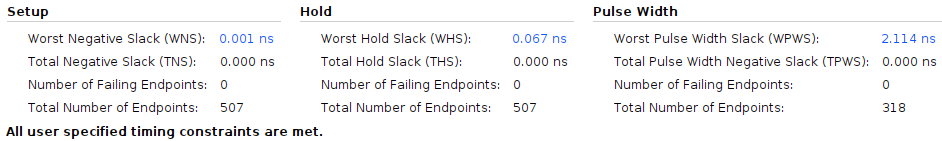
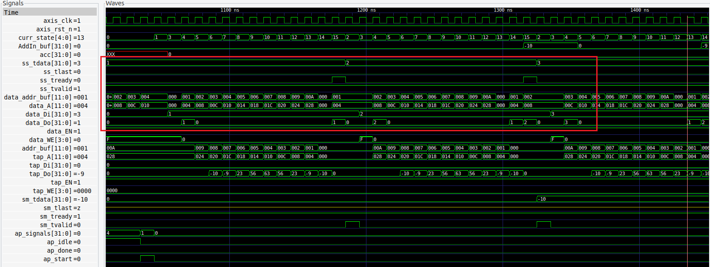

# FIR - Verilog implementation
## Specification
- Data_Width  32
- Tape_Num    11
- Data_Num    To be determined by data size
## Interface
-- data_in  stream （Xn）
-- data_out: stream ( Yn)
-- coef[Tape_Num-1:0]  axilite
-- len: axilite
-- ap_start:  axilite
-- ap_done: axilite
- Using one Multiplier and one Adder
- - Shift register implemented with SRAM (Shift_RAM, size = 10 DW) – size = 10 DW
- Tap coefficient implemented with SRAM (Tap_RAM = 11 DW) and initialized by axilite write
Operation
- ap_start to initiate FIR engine (ap_start valid for one clock cycle)
- Stream-in Xn. The rate is depending on the FIR processing speed. Use axi-stream valid/ready for flow control
- Stream out Yn, the output rate depends on FIR processing speed.

# SOC_LAB3
## Synthesis Report
### Cell Usage

### RTL Component Information

## Timing Report
### Timing Constraints

### Max Delay Path

### Slack

## Waveforms
### Configuration Write

### ap_start, ap_done ( measure # of clock cycles from ap_start to ap_done)

### Xn stream-in

### Yn stream-out

### Report
[Report](report.pdf)
